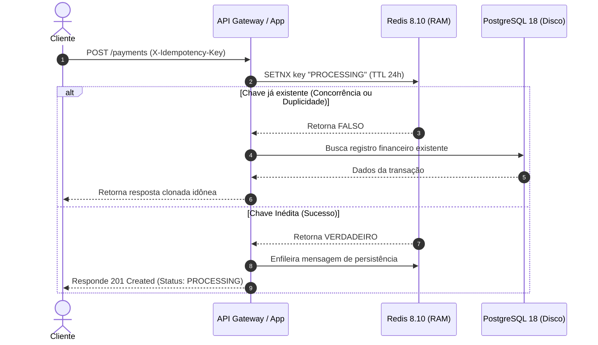

# Sistema de Pagamentos Idempotente Multilinguagem

Este repositório abriga um ecossistema distribuído voltado para o processamento de transações financeiras seguras, com controle estrito de idempotência e resiliência sob alta carga. O projeto foi desenhado sob uma abordagem poliglota para comparar e demonstrar a eficiência de diferentes paradigmas de desenvolvimento.

## Estrutura do Repositório

* `/spring-boot`: Microsserviço desenvolvido em Java 21 e Spring Boot 3.x, utilizando arquitetura assíncrona de alta vazão baseada em filas em memória.

* `/go-app`: Microsserviço planejado em Go (Golang), com foco em processamento nativo concorrente de baixa latência utilizando goroutines (Aguardando inicialização pós-leitura técnica).

* `/performance-tests`: Suíte de testes de carga e estresse utilizando Grafana k6 e relatórios históricos de evolução de infraestrutura.

* `/docs`: Documentação complementar, análises arquiteturais e referências teóricas de engenharia financeira.

## Stack Tecnológica Global

* Java 21 / Spring Boot 3.x

* Go (Golang)

* PostgreSQL 18 (Armazenamento Relacional ACID)

* Redis 8.10 (Escudo de Idempotência e Fila Assíncrona)

* Grafana k6 (Engenharia de Performance)

## Princípios Centrais da Arquitetura

### 1. Idempotency Key como Chave Única

O cliente deve enviar uma chave única por operação. O sistema aplica uma restrição de unicidade nessa chave no banco de dados para evitar o reprocessamento de novas chamadas.

### 2. Transações Atômicas

Validar, registrar e coordenar a execução com parceiros externos devem viver na mesma transação atômica. Uma falha no meio do caminho causa um rollback completo, evitando o estado indefinido.

### 3. Estratégia de Auditoria

Cada tentativa é registrada como um evento imutável. O estado atual serve como uma proteção do log, garantindo um histórico limpo das alterações.

### 4. Proteção contra Condições de Corrida

O fluxo evita o padrão de checar a existência e depois inserir em passos separados. São usadas operações seguras de banco de dados para eliminar a brecha entre a verificação e a escrita.

## Fluxo Macroscópico de Idempotência

## Status do Desenvolvimento Poliglota

### Módulo Java (Spring Boot)

* **Status:** Concluído e 100% Validado.

* **Características:** Implementação completa do padrão Write-Behind utilizando Redis como mensageria interna para blindar o PostgreSQL 18. Suporta cargas de estresse de 10.000 usuários simultâneos, atingindo vazão superior a 1.000 requisições por segundo nos testes de carga locais.

### Módulo Go (Golang)

* **Status:** Em Fase de Planejamento Estreito.

* **Estratégia:** A implementação prática deste módulo será iniciada imediatamente após a conclusão do ciclo completo de leituras, anotações e estudos dirigidos mapeados no arquivo de diretrizes localizado em `docs/REFERENCES-PAYMENT.md`. O objetivo é absorver os padrões de mercado da Stripe, Adyen e Wise antes de desenhar os componentes concorrentes nativos em Go.
