# LAB — PRÓXIMOS PASSOS DOS TESTES DE CARGA

## 1. Objetivo

Após os resultados obtidos no **REPORT-005**, o sistema apresentou uma evolução significativa de desempenho após a substituição do fluxo de persistência síncrona por uma arquitetura assíncrona baseada em **Redis + Write-Behind + Consumer + PostgreSQL**.

O próximo ciclo de experimentos terá como objetivo investigar os limites dessa arquitetura.

A ideia não é apenas aumentar a quantidade de usuários virtuais, mas verificar como o sistema se comporta diante de diferentes padrões de carga, saturação de recursos, acúmulo de mensagens e falhas de infraestrutura.

A mesma metodologia utilizada nos relatórios anteriores será mantida: **alterar uma variável ou componente por vez, executar o teste e comparar os resultados**.

---

# 2. Ponto de Partida

O **REPORT-005** será utilizado como baseline para os próximos experimentos.

| Métrica           |      Resultado     |
| :---------------- | :----------------: |
| Usuários Virtuais |   **10.000 VUs**   |
| Throughput        | **1.013,34 req/s** |
| Total Processado  |     **91.111**     |
| Taxa de Erro HTTP |      **3,65%**     |
| Latência Máxima   |     **15,77 s**    |
| Latência Mediana  |    **434,05 ms**   |
| Arquitetura       |  **Write-Behind**  |

A partir desse resultado, os próximos testes buscarão responder:

> **Até onde essa arquitetura consegue escalar e como ela se comporta quando seus componentes atingem seus limites?**

---

# 3. LAB-006 — Carga Sustentada

## Objetivo

Verificar se o sistema consegue manter uma carga elevada durante um período prolongado sem apresentar degradação progressiva.

O REPORT-005 demonstrou que a aplicação consegue atingir aproximadamente **1.000 req/s**, porém ainda é necessário verificar se essa vazão pode ser sustentada continuamente.

## Cenário

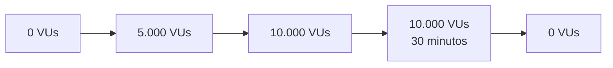

### Etapas

```text
Ramp-up:       0 → 5.000 VUs
Ramp-up:   5.000 → 10.000 VUs
Sustentação:   10.000 VUs por 30 minutos
Ramp-down: 10.000 → 0 VUs
```

## Métricas

Durante o teste deverão ser observados:

* Throughput;
* p50;
* p95;
* p99;
* taxa de erro;
* CPU;
* memória;
* conexões Redis;
* memória utilizada pelo Redis;
* tamanho da fila;
* taxa de processamento do Consumer;
* conexões do PostgreSQL;
* utilização do PostgreSQL;
* I/O de disco.

## Pergunta

> O sistema consegue sustentar aproximadamente 1.000 req/s durante 30 minutos sem apresentar degradação progressiva?

---

# 4. LAB-007 — Stress Test

## Objetivo

Encontrar o ponto de saturação da arquitetura.

Nesse teste, a carga será aumentada progressivamente até que o sistema deixe de apresentar ganhos significativos de throughput ou algum recurso se torne o novo gargalo.

## Cenário

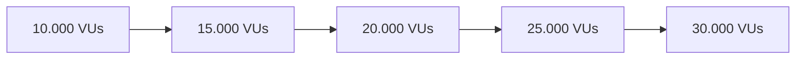

O objetivo não é necessariamente obter uma execução com baixa taxa de erro.

O objetivo é descobrir:

* quando o throughput para de crescer;
* quando a latência começa a aumentar significativamente;
* quando a fila começa a acumular;
* quando CPU ou memória chegam próximo do limite;
* quando Redis se torna gargalo;
* quando PostgreSQL se torna gargalo novamente.

### Pergunta

> Qual é o maior throughput que a infraestrutura atual consegue sustentar antes de entrar em saturação?

---

# 5. LAB-008 — Spike Test

## Objetivo

Avaliar o comportamento do sistema diante de um aumento repentino de tráfego.

Diferentemente do teste de carga sustentada, aqui a alteração de carga será propositalmente brusca.

## Cenário

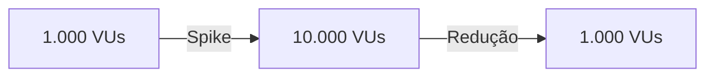

Durante o pico deverão ser observados:

* aumento da latência;
* taxa de erros;
* crescimento da fila;
* capacidade do Consumer;
* utilização de CPU;
* utilização de memória;
* tempo necessário para recuperação.

### Pergunta

> Depois de um pico extremo de tráfego, o sistema consegue retornar ao comportamento normal?

---

# 6. LAB-009 — Backpressure e Acúmulo da Fila

## Objetivo

Investigar o comportamento da arquitetura quando a taxa de entrada de mensagens é superior à capacidade de processamento do Consumer.

Por exemplo:

```text
Entrada:   1.500 mensagens/s
Consumer:  1.000 mensagens/s
```

Nesse cenário, espera-se que a fila acumule mensagens.

## Fluxo

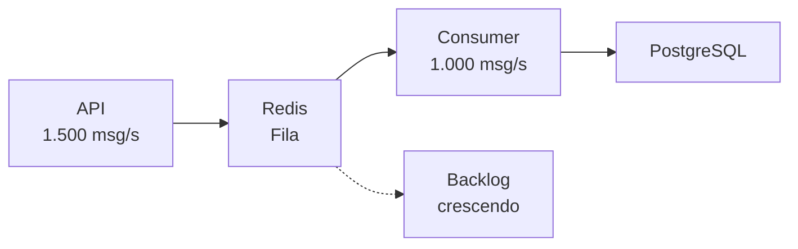

## Métricas

Deverão ser acompanhados:

* tamanho da fila;
* taxa de entrada;
* taxa de consumo;
* tempo de processamento;
* memória do Redis;
* throughput do PostgreSQL;
* tempo necessário para esvaziar o backlog.

### Perguntas

> A fila consegue absorver temporariamente o excesso de carga?

> O Consumer consegue recuperar o backlog posteriormente?

> Existe um ponto em que o crescimento da fila se torna indefinido?

---

# 7. LAB-010 — Teste de Colisão de Idempotência

## Objetivo

Nos testes anteriores, foram utilizadas chaves de idempotência inéditas para avaliar a capacidade de processamento de novas operações.

Agora será realizado o cenário inverso: milhares de requisições utilizarão a **mesma chave de idempotência**.

O objetivo será validar especificamente o comportamento do escudo de Redis.

## Fluxo

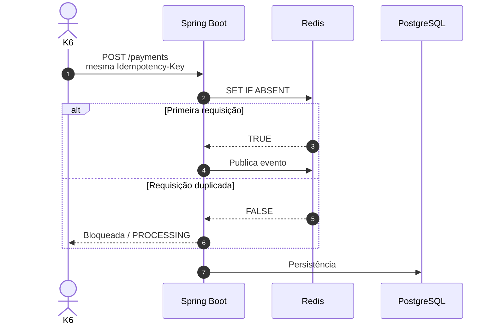

## Métricas

* requisições aceitas;
* requisições bloqueadas;
* operações realizadas no PostgreSQL;
* latência do Redis;
* throughput;
* quantidade de pagamentos efetivamente persistidos.

### Pergunta

> Milhares de requisições concorrentes utilizando a mesma chave conseguem ser bloqueadas na camada Redis sem sobrecarregar o PostgreSQL?

---

# 8. LAB-011 — Falha do PostgreSQL

## Objetivo

Validar o comportamento da arquitetura quando o banco de dados fica temporariamente indisponível.

O experimento deverá demonstrar se o desacoplamento proporcionado pelo Write-Behind realmente permite que a fila absorva a indisponibilidade temporária do banco.

## Cenário

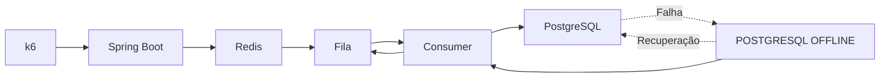

## Durante a falha

Verificar:

* se as mensagens continuam sendo armazenadas;
* se o Consumer continua tentando processar;
* se mensagens são perdidas;
* se ocorrem duplicidades;
* se o sistema consegue recuperar o backlog após o banco retornar.

### Pergunta

> O sistema consegue sobreviver temporariamente à indisponibilidade do PostgreSQL sem perder as operações recebidas?

---

# 9. LAB-012 — Falha do Redis

## Objetivo

Avaliar o comportamento da aplicação quando o Redis fica indisponível.

Nesse projeto, o Redis possui uma função crítica tanto para o controle de idempotência quanto para o mecanismo de mensageria.

## Cenário

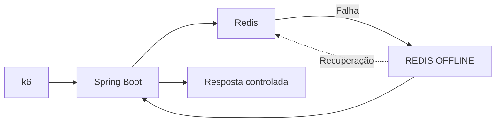

## Verificar

* comportamento da API;
* código HTTP retornado;
* existência de fallback;
* possibilidade de bypass do controle de idempotência;
* recuperação após o Redis retornar.

### Pergunta

> O sistema falha de maneira controlada quando sua camada de cache e mensageria fica indisponível?

---

# 10. LAB-013 — Falha do Consumer

## Objetivo

Verificar o comportamento da fila quando ocorre uma falha durante o processamento de uma mensagem.

O objetivo futuro será implementar mecanismos de **Retry** e **Dead Letter Queue (DLQ)**.

## Fluxo esperado

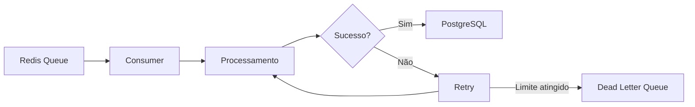

## Perguntas

* A mensagem é perdida?
* A mensagem pode ser processada novamente?
* Existe risco de duplicidade?
* Quantas tentativas devem ser realizadas?
* O que acontece depois do limite de tentativas?

---

# 11. LAB-014 — Escalabilidade Horizontal

## Objetivo

Depois de validar o comportamento de uma única instância da aplicação, será avaliada a capacidade de escalar horizontalmente.

## Cenário

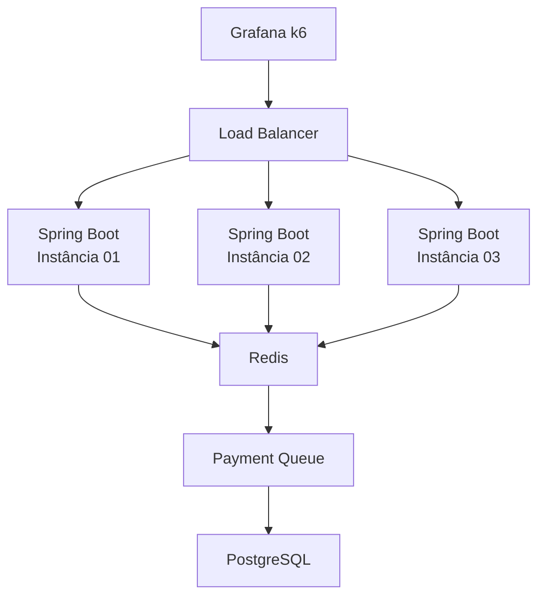

## Comparação

Serão comparados cenários com:

```text
1 instância
2 instâncias
3 instâncias
```

### Pergunta

> O aumento do número de instâncias aumenta proporcionalmente a capacidade de processamento ou outro componente passa a ser o gargalo?

---

# 12. LAB-015 — Carga Prolongada

Após identificar o limite de saturação e validar o comportamento da fila, será realizado um teste de longa duração.

## Objetivo

Verificar possíveis problemas que não aparecem em testes curtos.

Exemplos:

* crescimento de memória;
* vazamento de recursos;
* crescimento contínuo da fila;
* degradação de throughput;
* aumento progressivo da latência;
* saturação do Redis;
* saturação do PostgreSQL.

## Cenário

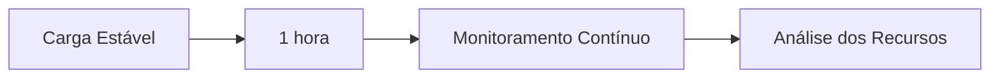

Esse teste será importante para diferenciar uma arquitetura que **atinge alto throughput momentaneamente** de uma arquitetura capaz de **operar de maneira estável durante longos períodos**.

---

# 13. Ordem da LAB

Os experimentos serão executados progressivamente:

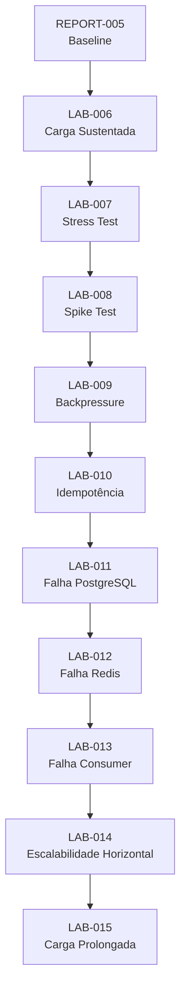

---

# 14. Métricas a Serem Acompanhadas

O k6 continuará sendo utilizado como principal ferramenta para geração da carga e coleta das métricas HTTP.

Além das métricas do k6, serão observados os componentes internos da aplicação.

| Camada                  | Métricas                                               |
| :---------------------- | :----------------------------------------------------- |
| **k6**                  | VUs, req/s, p50, p95, p99, erros                       |
| **Spring Boot**         | Threads, CPU, memória, latência                        |
| **Redis**               | Memória, conexões, latência, tamanho da fila           |
| **Consumer**            | Mensagens processadas/s, erros, tempo de processamento |
| **PostgreSQL**          | Conexões, CPU, I/O, transações, latência               |
| **Sistema Operacional** | CPU, RAM, I/O Wait, disco                              |

---

# 15. Objetivo Final

Os próximos testes devem permitir construir um mapa mais completo do comportamento da arquitetura:

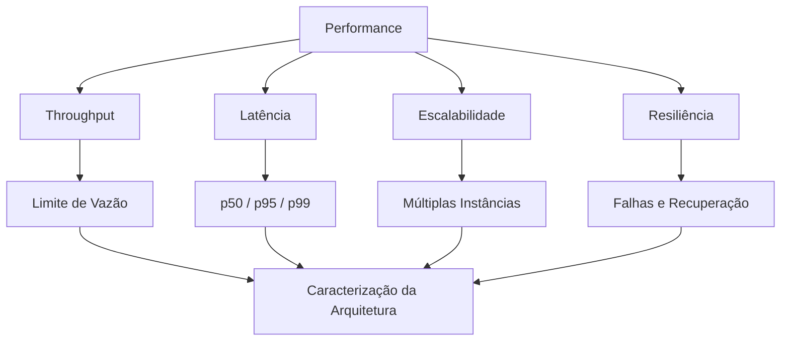

A investigação deixa de ter como única pergunta:

> **"Quantas requisições por segundo o sistema consegue processar?"**

E passa a investigar:

> **"Qual é o limite da arquitetura, como ela se comporta sob diferentes padrões de carga e como reage quando seus componentes atingem seus limites ou ficam indisponíveis?"**

O **REPORT-005** estabelece o baseline de desempenho.

As próximas LABs terão como objetivo caracterizar os limites de **performance, escalabilidade, consistência e resiliência** da arquitetura.
