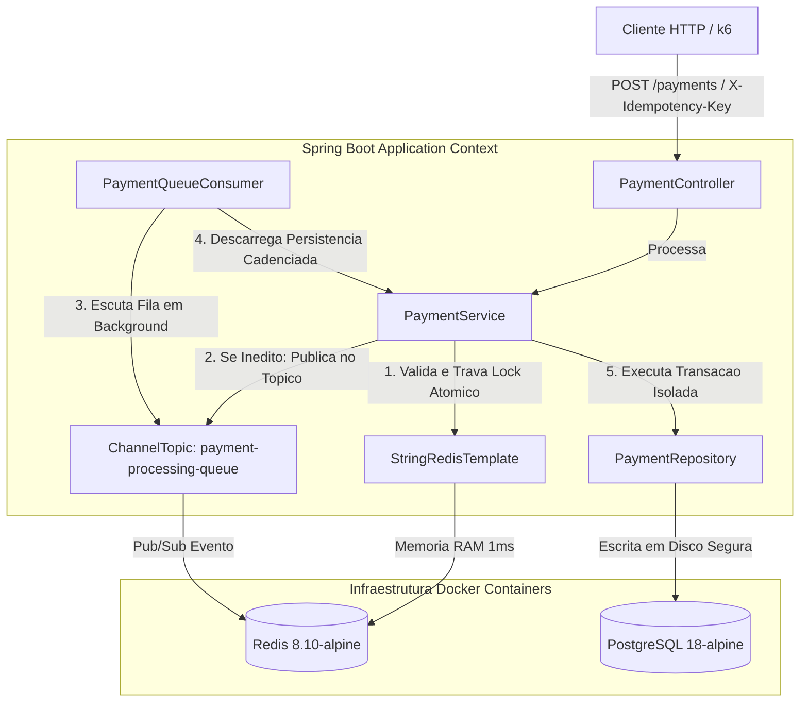

# Microsservico de Pagamentos Idempotente (Spring Boot)

Este modulo contem a implementacao em Java 21 e Spring Boot 3.x do motor de pagamentos. Ele adota o padrao arquitetural Write-Behind (Escrita Assincrona) para suportar picos extremos de tráfego síncrono HTTP sem causar exaustao de hardware ou estrangulamento no banco de dados relacional.

## Stack Tecnologica Especifica

*   Java 21 / Spring Boot 3.x
*   Spring Data JPA & HikariCP
*   Spring Data Redis (Driver Lettuce com Pool de Conexoes)
*   Flyway Migrations
*   Testcontainers & JUnit 5 (Testes de Integracao Isolados via Docker)

## Principios Centrais da Arquitetura

### 1. Escudo Atómico em Memoria (Redis 8.10)
Toda requisicao e interceptada na camada de memoria RAM utilizando a instrucao atomica `setIfAbsent`. Isso garante o barramento de requisicoes concorrentes duplicadas em menos de 1 milissegundo, impedindo que chamadas redundantes disputem threads do servidor HTTP ou conexoes com o banco de dados.

### 2. Padrao de Escrita Assincrona (Write-Behind)
Para suportar cargas massivas de operacoes de escrita (como 10.000 requisicoes simultaneas por segundo), a thread HTTP nao executa operacoes síncronas de escrita em disco. O payload e serializado e enviado instantaneamente para um canal do Redis (`payment-processing-queue`), liberando o cliente imediatamente com o status `PROCESSING`.

### 3. Persistencia Cadenciada (Background Consumer)
Um componente trabalhador assincrono escuta as mensagens da fila em background e executa os commits no PostgreSQL de forma controlada. Se houver falhas na adquirente externa, o banco executa um rollback atomico completo isolado, preservando a integridade dos logs de auditoria imutaveis.

## Diagrama Detalhado da Arquitetura Interna



## Automacao da Infraestrutura Local (Scripts Shell)

O projeto disponibiliza scripts automatizados `.sh` dentro do diretorio de scripts para gerenciar de forma rapida o ciclo de vida dos contêineres Docker (PostgreSQL 18 e Redis 8.10).

### 1. Inicializar e Provisionar o Ambiente
Para subir os bancos de dados em segundo plano e aplicar as configuracoes de rede locais, execute o script de inicializacao:
```bash
./scripts/run-infra.sh
```

### 2. Destruir e Limpar o Ambiente
Para encerrar a execucao de todos os servicos locais, remover os contêineres e apagar completamente os volumes de dados residuais do disco, execute o script de destruicao:
```bash
./scripts/destroy-infra.sh
```

## Como Executar a Suite de Testes do Projeto

Para compilar o projeto e executar todos os testes unitarios e os testes de integracao baseados em contêineres dinâmicos (Testcontainers), certifique-se de que o Docker local está ativo e execute:

```bash
./mvnw clean test
```
