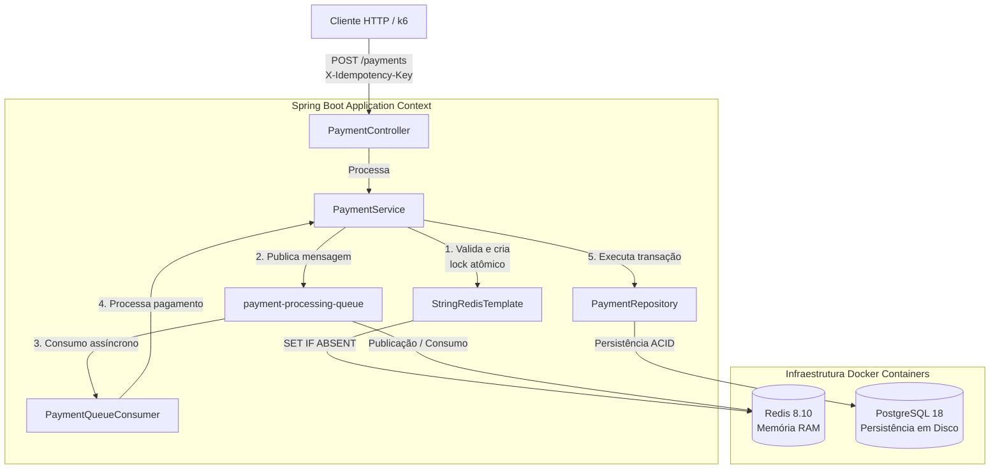

# Microsserviço de Pagamentos Idempotente (Spring Boot)

Este módulo contém a implementação em Java 21 e Spring Boot 3.x do motor de pagamentos. Ele adota o padrão arquitetural Write-Behind (Escrita Assíncrona) para suportar picos extremos de tráfego síncrono HTTP sem causar exaustão de hardware ou estrangulamento no banco de dados relacional.

## Stack Tecnológica Específica

* Java 21 / Spring Boot 3.x

* Spring Data JPA & HikariCP

* Spring Data Redis (Driver Lettuce com Pool de Conexões)

* Flyway Migrations

* Testcontainers & JUnit 5 (Testes de Integração Isolados via Docker)

## Princípios Centrais da Arquitetura

### 1. Escudo Atômico em Memória (Redis 8.10)

Toda requisição é interceptada na camada de memória RAM utilizando a instrução atômica `setIfAbsent`. Isso garante o bloqueio de requisições concorrentes duplicadas, impedindo que chamadas redundantes disputem threads do servidor HTTP ou conexões com o banco de dados.

### 2. Padrão de Escrita Assíncrona (Write-Behind)

Para suportar cargas massivas de operações de escrita, a thread HTTP não executa operações síncronas de escrita em disco. O payload é serializado e enviado instantaneamente para um canal do Redis (`payment-processing-queue`), liberando o cliente imediatamente com o status `PROCESSING`.

### 3. Persistência Cadenciada (Background Consumer)

Um componente trabalhador assíncrono escuta as mensagens da fila em background e executa os commits no PostgreSQL de forma controlada. Se houver falhas durante o processamento, o banco executa um rollback atômico completo, preservando a integridade dos dados e dos logs de auditoria.

## Diagrama Detalhado da Arquitetura Interna



## Automação da Infraestrutura Local (Scripts Shell)

O projeto disponibiliza scripts automatizados `.sh` dentro do diretório de scripts para gerenciar de forma rápida o ciclo de vida dos contêineres Docker, incluindo PostgreSQL 18 e Redis 8.10.

### 1. Inicializar e Provisionar o Ambiente

Para subir os bancos de dados em segundo plano e aplicar as configurações de rede locais, execute o script de inicialização:

```bash
./scripts/run-infra.sh
```

### 2. Destruir e Limpar o Ambiente

Para encerrar a execução de todos os serviços locais, remover os contêineres e apagar completamente os volumes de dados residuais do disco, execute o script de destruição:

```bash
./scripts/destroy-infra.sh
```

## Como Executar a Suíte de Testes do Projeto

Para compilar o projeto e executar todos os testes unitários e os testes de integração baseados em contêineres dinâmicos com Testcontainers, certifique-se de que o Docker local esteja ativo e execute:

```bash
./mvnw clean test
```
