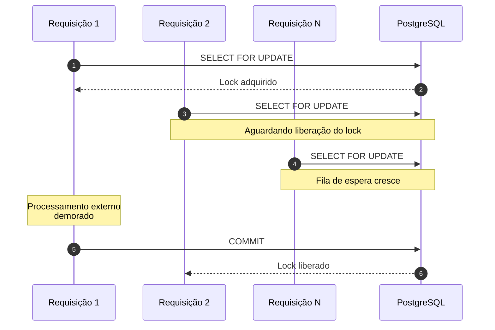
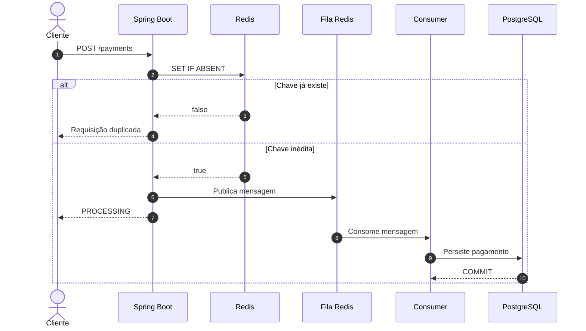
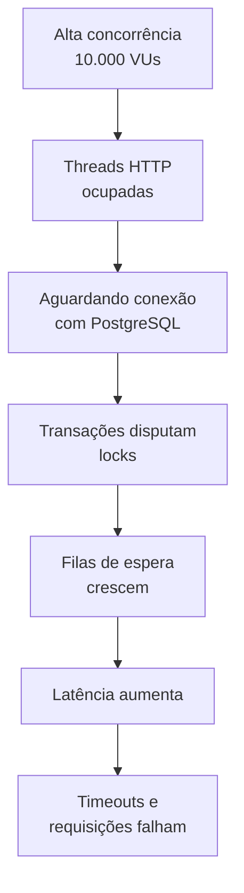

Claro. Mantive a estrutura, corrigi a acentuação e melhorei alguns pontos de redação e consistência técnica, sem alterar a proposta do relatório.

# Relatório Avançado de Engenharia de Performance #001

## 1. Resumo Executivo

* **Data do Teste:** 27 de agosto de 2026

* **Ambiente:** Local (Ubuntu 24.04 LTS / OpenJDK 21)

* **Ferramenta Utilizada:** Grafana k6 v1.x

* **Alvo do Teste:** Endpoint `POST /api/v1/payments`

* **Carga Aplicada:** Rampa progressiva com pico de 10.000 Usuários Virtuais Simultâneos (VUs)

* **Resultado Geral:** **FALHA DE INFRAESTRUTURA — SISTEMA EM COLAPSO**

---

## 2. Métricas Coletadas e Tradução Técnica

| Métrica                        | Valor Coletado              | Status  | Impacto Técnico Real                                                                                                                        |
| :----------------------------- | :-------------------------- | :------ | :------------------------------------------------------------------------------------------------------------------------------------------ |
| **`http_req_failed`**          | **84,12%** (2.067 de 2.457) | FALHA   | O servidor rejeitou a maioria absoluta do tráfego. Os clientes receberam erros e timeouts severos.                                          |
| **`http_req_duration` (Máx.)** | **1 min** (60.000 ms)       | CRÍTICO | Parte das requisições permaneceu aguardando até atingir o limite de timeout configurado ou imposto pelo ambiente de teste.                  |
| **`http_req_duration` (p95)**  | **1 min** (60.000 ms)       | CRÍTICO | Aproximadamente 95% das requisições mais lentas ficaram próximas do limite máximo observado, indicando saturação severa do sistema.         |
| **`http_reqs` (Vazão)**        | **27,29 req/s**             | BAIXO   | Throughput extremamente reduzido para a carga aplicada, indicando contenção, bloqueios e esgotamento de recursos.                           |
| **`Interrupted Iterations`**   | **7.931**                   | ALTO    | Grande quantidade de iterações foi interrompida antes da conclusão, indicando que o sistema não conseguiu acompanhar a progressão da carga. |

---

## 3. Análise Detalhada da Causa Raiz e dos Gargalos

O colapso não foi causado por um problema isolado de lógica ou sintaxe no código Java. O cenário indica um efeito cascata provocado pela combinação entre alta concorrência, operações bloqueantes, limitação dos pools de recursos e persistência síncrona no banco de dados.

A principal consequência foi a formação progressiva de filas de espera. À medida que os recursos disponíveis eram esgotados, novas requisições permaneciam bloqueadas aguardando threads, conexões ou locks, aumentando ainda mais o tempo de resposta e provocando um ciclo de saturação.

### Gargalo 1: Esgotamento de Threads do Servidor HTTP

O servidor web embutido do Spring Boot possui um número limitado de threads disponíveis para processar requisições simultâneas.

Quando a carga aumentou progressivamente até milhares de conexões concorrentes, uma parte significativa das threads passou a permanecer bloqueada aguardando operações posteriores, como acesso ao banco de dados e aquisição de locks.

Consequentemente, novas requisições começaram a se acumular nas filas internas do servidor, aumentando o tempo de resposta até a ocorrência de timeouts.

O problema não está necessariamente no número absoluto de threads, mas principalmente no fato de que cada thread HTTP permanece ocupada enquanto aguarda operações potencialmente lentas ou bloqueantes.

### Gargalo 2: Saturação do Pool de Conexões com o Banco de Dados

O HikariCP controla a quantidade de conexões simultâneas disponíveis para comunicação com o PostgreSQL.

Quando o número de operações concorrentes ultrapassa a capacidade do pool, as threads da aplicação precisam aguardar até que uma conexão seja liberada.

Em um cenário com milhares de requisições simultâneas, uma combinação de:

* threads HTTP bloqueadas;
* operações de banco demoradas;
* locks mantidos por transações;
* número limitado de conexões;

pode provocar uma fila crescente de requisições aguardando acesso ao PostgreSQL.

Esse comportamento contribui diretamente para o aumento da latência e para a propagação do congestionamento por toda a aplicação.

### Gargalo 3: Contenção Provocada pelo Lock Pessimista

Para garantir consistência e evitar condições de corrida, foi utilizado um lock pessimista na camada de persistência:

```java
@Lock(LockModeType.PESSIMISTIC_WRITE)
@Query("SELECT p FROM Payment p WHERE p.idempotencyKey = :idempotencyKey")
Optional<Payment> findByIdempotencyKeyForUpdate(String idempotencyKey);
```

No PostgreSQL, essa estratégia pode resultar na utilização de `SELECT ... FOR UPDATE`, fazendo com que outras transações concorrentes aguardem a liberação do lock antes de continuar.

Caso milhares de requisições utilizem a mesma chave de idempotência, ou disputem recursos relacionados, múltiplas transações podem permanecer aguardando.

Se a transação que possui o lock também executa uma operação demorada — como a simulação de comunicação com um gateway externo — o período de contenção aumenta significativamente.

O fluxo pode ser representado da seguinte forma:



Nesse cenário, o lock pessimista pode transformar uma contenção pontual em uma fila crescente de transações bloqueadas.

---

## 4. Próximas Ações Recomendadas e Justificativas Técnicas

### 4.1 Fine-Tuning do `application.yml`

Uma primeira medida é ajustar os limites de concorrência da aplicação e reduzir o tempo máximo de espera por recursos.

```yaml
server:
  tomcat:
    threads:
      max: 1000
      min-spare: 50

spring:
  datasource:
    hikari:
      maximum-pool-size: 100
      minimum-idle: 20
      connection-timeout: 5000
```

**Por que aplicar:**

O aumento da capacidade de threads e conexões pode elevar o número de operações concorrentes que a aplicação consegue administrar.

No entanto, esses valores não devem ser considerados universais. Um pool de conexões maior também aumenta a pressão sobre o PostgreSQL.

O principal benefício do `connection-timeout` reduzido para 5 segundos é impedir que threads permaneçam aguardando indefinidamente por uma conexão disponível. Caso o banco esteja saturado, a aplicação falha mais rapidamente e libera recursos para outras operações.

A estratégia ideal é dimensionar esses valores com base em novos testes de carga e na capacidade real da máquina e do PostgreSQL.

### 4.2 Adicionar Timeout para Operações de Lock

O repositório pode ser configurado para limitar o tempo máximo de espera pela aquisição de um lock:

```java
@Lock(LockModeType.PESSIMISTIC_WRITE)
@QueryHints({
    @QueryHint(
        name = "jakarta.persistence.lock.timeout",
        value = "2000"
    )
})
@Query("SELECT p FROM Payment p WHERE p.idempotencyKey = :idempotencyKey")
Optional<Payment> findByIdempotencyKeyForUpdate(
    String idempotencyKey
);
```

**Por que aplicar:**

Sem uma estratégia explícita de timeout, transações concorrentes podem permanecer aguardando por períodos excessivos, dependendo da configuração do banco de dados e da transação.

A definição de um limite reduz o risco de formação de filas prolongadas.

Caso o lock não seja adquirido dentro do período configurado, a aplicação pode capturar a exceção e retornar uma resposta controlada, em vez de manter threads bloqueadas até que ocorra um timeout mais amplo.

### 4.3 Acoplar um Escudo de Idempotência com Redis

Uma alternativa para reduzir a pressão sobre o PostgreSQL é interceptar requisições duplicadas antes que elas alcancem a camada de persistência.

```java
Boolean isSaved = redisTemplate.opsForValue()
    .setIfAbsent(
        "idempotency:" + key,
        "PROCESSING",
        Duration.ofHours(24)
    );

if (Boolean.FALSE.equals(isSaved)) {
    throw new PaymentProcessingException(
        "Concurrent request blocked by cache shield."
    );
}
```

**Por que aplicar:**

O PostgreSQL é responsável pela persistência definitiva e pela garantia de integridade dos dados, mas não é necessariamente a melhor primeira barreira para milhares de verificações concorrentes da mesma chave.

O Redis permite executar operações atômicas em memória, reduzindo significativamente a quantidade de requisições duplicadas que chegam ao banco de dados.

Com essa abordagem, o fluxo passa a funcionar da seguinte forma:



Dessa forma, requisições duplicadas podem ser bloqueadas antes de consumir conexões do PostgreSQL ou disputar locks pessimistas.

---

## 5. Conclusão Técnica

O teste revelou que a arquitetura, em seu estado inicial, não conseguiu sustentar a carga aplicada de 10.000 usuários virtuais simultâneos.

O principal problema observado não foi apenas a quantidade de usuários concorrentes, mas o acúmulo de operações bloqueantes em múltiplas camadas da aplicação.

O fluxo de saturação pode ser resumido da seguinte forma:



As próximas etapas devem priorizar a eliminação de bloqueios desnecessários no caminho síncrono da requisição.

A estratégia proposta consiste em utilizar:

1. Redis como primeira camada de proteção contra requisições duplicadas;
2. processamento assíncrono para desacoplar a resposta HTTP da persistência;
3. limites de timeout para impedir filas indefinidas;
4. dimensionamento controlado dos pools de threads e conexões;
5. novos testes de carga após cada alteração arquitetural.

O objetivo do próximo ciclo de testes será verificar se a remoção da contenção direta sobre o PostgreSQL permite aumentar progressivamente a vazão, reduzir o `http_req_failed` e manter os percentis de latência dentro de limites aceitáveis.
