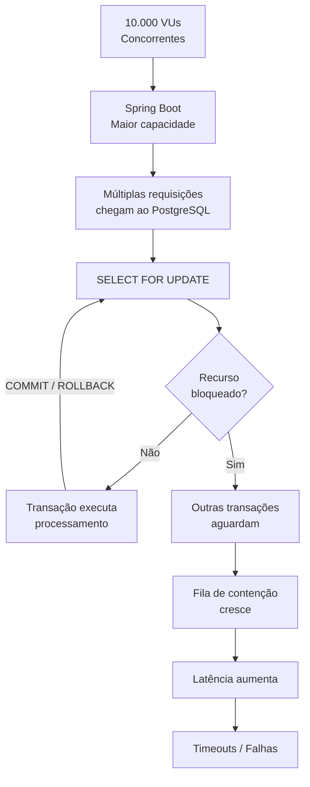
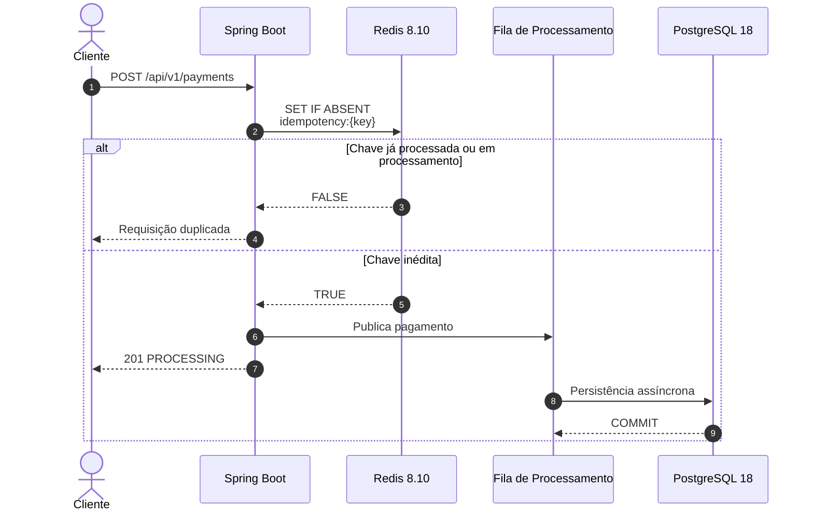
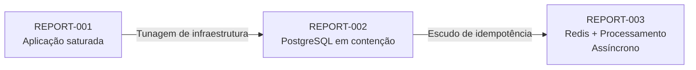

# Relatório Avançado de Engenharia de Performance #002

## 1. Resumo Executivo

* **Data do Teste:** 27 de agosto de 2026

* **Ambiente:** Local (Ubuntu 24.04 LTS / OpenJDK 21)

* **Ferramenta Utilizada:** Grafana k6 v1.x

* **Alvo do Teste:** Endpoint `POST /api/v1/payments`

* **Carga Aplicada:** Pico de 10.000 Usuários Virtuais Simultâneos (VUs) após a tunagem da infraestrutura

* **Resultado Geral:** **EVOLUÇÃO DE VAZÃO COM GARGALO DE CONTENÇÃO NO POSTGRESQL**

---

## 2. Análise Comparativa de Evolução (REPORT-001 vs REPORT-002)

| Métrica                        | Resultado Anterior (001) | Resultado Atual (002)   | Evolução / Impacto Técnico                                                                                  |
| :----------------------------- | :----------------------- | :---------------------- | :---------------------------------------------------------------------------------------------------------- |
| **`http_reqs` (Vazão)**        | 27,29 req/s              | **133,56 req/s**        | Crescimento de aproximadamente **389%** na vazão observada do Spring Boot.                                  |
| **`checks_total`**             | 2.457                    | **12.023**              | O sistema processou aproximadamente **9.566 verificações adicionais** sob a mesma carga máxima configurada. |
| **`http_req_failed`**          | 84,12%                   | **64,10%**              | Redução de **20,02 pontos percentuais** na taxa de falhas.                                                  |
| **`http_req_duration` (Máx.)** | 1 min (60.000 ms)        | **43,98 s** (43.980 ms) | Redução de aproximadamente **16 segundos** no maior tempo de resposta observado.                            |
| **`Interrupted Iterations`**   | 7.931                    | **4.910**               | Redução de aproximadamente **38%**, indicando menor quantidade de iterações interrompidas durante o teste.  |

### Evolução da Vazão

A alteração das configurações de infraestrutura produziu um aumento expressivo na capacidade de processamento observada.

A vazão passou de **27,29 req/s para 133,56 req/s**, representando um crescimento de aproximadamente **4,9 vezes** em relação ao primeiro teste.

Esse resultado demonstra que parte significativa da limitação observada no REPORT-001 estava relacionada à configuração dos recursos de execução da aplicação, especialmente threads HTTP e gerenciamento do pool de conexões.

Entretanto, a taxa de falhas permaneceu elevada, indicando que o aumento da capacidade de processamento apenas deslocou o gargalo para uma camada posterior da arquitetura.

---

## 3. Diagnóstico do Novo Gargalo Encontrado

A tunagem do `application.yml` e o ajuste dos parâmetros do HikariCP reduziram significativamente a contenção observada anteriormente nas camadas de aplicação.

Com o aumento da capacidade de concorrência do Spring Boot e do Tomcat, o sistema passou a conseguir processar um volume significativamente maior de requisições.

Entretanto, esse aumento de capacidade expôs um novo gargalo: **a contenção na camada de persistência do PostgreSQL 18**.

O principal ponto de atenção está relacionado ao uso do Lock Pessimista (`SELECT FOR UPDATE`) durante o processamento das operações.

Em um cenário de alta concorrência, múltiplas transações podem disputar simultaneamente o mesmo recurso protegido pelo lock. Enquanto uma transação mantém o bloqueio, as demais precisam aguardar sua liberação.

O problema torna-se ainda mais significativo quando a transação permanece aberta durante operações relativamente demoradas.

O fluxo observado pode ser simplificado da seguinte maneira:

Dessa forma, o problema deixa de estar concentrado exclusivamente na capacidade de execução do servidor HTTP e passa a envolver a capacidade de processamento concorrente da camada de persistência.

É importante destacar que o PostgreSQL não necessariamente está limitado apenas pela velocidade física do disco. A contenção observada pode envolver uma combinação de fatores, como:

* disputa por locks;
* número de conexões simultâneas;
* tempo de duração das transações;
* operações de I/O;
* concorrência sobre os mesmos registros;
* capacidade de CPU e memória;
* configuração do pool de conexões;
* custo das operações de persistência.

Portanto, o próximo ciclo de otimização deve concentrar-se principalmente na redução da quantidade de operações que chegam ao banco de dados e na diminuição do tempo de permanência das transações.

---

## 4. Próximo Passo Arquitetural — A Solução Definitiva

Os testes **001 e 002** forneceram evidências de que utilizar diretamente o banco de dados relacional como primeira barreira para o controle de idempotência cria um ponto de contenção quando submetido a volumes elevados de requisições concorrentes.

A próxima evolução arquitetural será a implementação de um **Escudo de Cache Distribuído com Redis**.

A ideia é deslocar a primeira verificação da chave de idempotência para uma camada especializada em operações rápidas de chave-valor.

O fluxo proposto será:

Com essa abordagem, as requisições concorrentes que utilizarem a mesma chave de idempotência poderão ser filtradas antes de disputar conexões e locks no PostgreSQL.

O Redis passa a funcionar como uma **primeira camada de proteção**, enquanto o PostgreSQL continua sendo a fonte definitiva de persistência e integridade dos dados.

### Objetivo do REPORT-003

O próximo teste deverá verificar empiricamente se a introdução do Redis como escudo de idempotência consegue:

* aumentar novamente a vazão (`http_reqs`);
* reduzir a taxa de falhas (`http_req_failed`);
* diminuir a latência (`http_req_duration`);
* reduzir as iterações interrompidas;
* diminuir a quantidade de requisições que chegam ao PostgreSQL;
* reduzir a contenção provocada pelo `SELECT FOR UPDATE`;
* manter o PostgreSQL dentro de níveis aceitáveis de utilização.

O objetivo não é simplesmente aumentar o número de threads ou conexões disponíveis, mas **reduzir a quantidade de trabalho desnecessário que chega às camadas mais custosas do sistema**.

---

## 5. Conclusão Técnica

O REPORT-002 demonstra uma evolução significativa em relação ao primeiro ciclo de testes.

A vazão aumentou de **27,29 req/s para 133,56 req/s**, enquanto o número de iterações interrompidas caiu de **7.931 para 4.910**.

Apesar da melhoria, a taxa de falhas ainda permanece elevada, com **64,10% das requisições apresentando falha**.

Isso demonstra que a simples expansão dos recursos de execução da aplicação não é suficiente para solucionar o problema em cenários de concorrência extrema.

O segundo teste revelou um princípio importante para a evolução da arquitetura:

> **Aumentar a capacidade de processamento da aplicação pode apenas deslocar o gargalo para a próxima camada.**

No REPORT-001, o principal problema estava associado à saturação das threads e do pool de conexões.

No REPORT-002, após a tunagem desses componentes, a contenção passou a se concentrar na camada de persistência.

O próximo passo será, portanto, reduzir a pressão sobre o PostgreSQL utilizando o **Redis como escudo distribuído de idempotência**, permitindo que requisições duplicadas sejam identificadas e rejeitadas antes de alcançarem a camada transacional.

Essa alteração permitirá comparar empiricamente três estágios da arquitetura:

O REPORT-003 será utilizado para validar se essa mudança arquitetural consegue transformar o ganho de capacidade obtido na camada HTTP em **maior vazão efetiva, menor latência e menor pressão sobre o banco de dados**.
