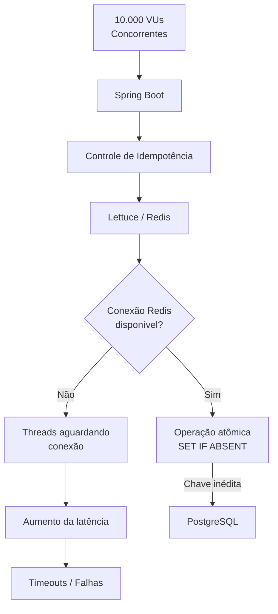
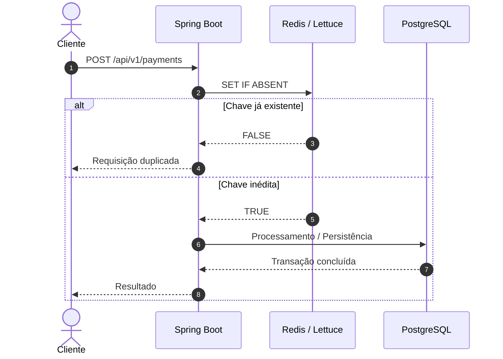
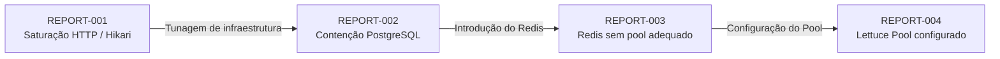

# Relatório Avançado de Engenharia de Performance #003

## 1. Resumo Executivo

* **Data do Teste:** 27 de agosto de 2026

* **Ambiente:** Local (Ubuntu 24.04 LTS / OpenJDK 21)

* **Ferramenta Utilizada:** Grafana k6 v1.x

* **Alvo do Teste:** Endpoint `POST /api/v1/payments`

* **Carga Aplicada:** Pico de 10.000 Usuários Virtuais Simultâneos (VUs)

* **Resultado Geral:** **ESTAGNAÇÃO DE VAZÃO POR LIMITAÇÃO NA CAMADA DE CONEXÃO COM O CACHE**

---

## 2. Métricas Coletadas e Diagnóstico Estático

| Métrica                        | Resultado Anterior (002) | Resultado Atual (003) | Status    |
| :----------------------------- | :----------------------- | :-------------------- | :-------- |
| **`http_reqs` (Vazão)**        | 133,56 req/s             | **137,18 req/s**      | ESTAGNADO |
| **`http_req_failed`**          | 64,10%                   | **65,27%**            | ESTAGNADO |
| **`http_req_duration` (Máx.)** | 43,98 s                  | **43,90 s**           | ESTAGNADO |

Os resultados do REPORT-003 apresentam comportamento praticamente idêntico ao observado no REPORT-002.

A vazão apresentou uma variação de apenas aproximadamente **2,7%**, passando de **133,56 req/s para 137,18 req/s**, enquanto a taxa de falhas apresentou uma pequena piora, passando de **64,10% para 65,27%**.

Da mesma forma, o tempo máximo de resposta permaneceu praticamente inalterado, passando de **43,98 s para 43,90 s**.

Esse comportamento indica que a alteração introduzida no fluxo de idempotência ainda não foi capaz de produzir um ganho significativo de capacidade sob a carga aplicada.

A hipótese principal para o próximo ciclo de investigação está relacionada à configuração da camada de conexão do Redis utilizada pelo driver Lettuce.

Sem um pool de conexões adequadamente configurado, a aplicação pode enfrentar contenção na aquisição e gerenciamento de conexões durante cargas extremamente concorrentes. Nesse cenário, a introdução do Redis não necessariamente elimina o gargalo: ela pode simplesmente adicionar uma nova camada de contenção antes que a requisição consiga ser efetivamente processada.

O fluxo de saturação pode ser representado da seguinte forma:



O objetivo do próximo ciclo será verificar se a configuração explícita do pool de conexões do Lettuce consegue eliminar essa possível contenção.

---

## 3. Plano de Correção e Mitigação

### Ação 1 — Adicionar `commons-pool2`

O primeiro passo será adicionar a biblioteca `commons-pool2` ao `pom.xml`, permitindo que o Spring Data Redis utilize o suporte de pooling disponibilizado pelo Lettuce.

A dependência deverá ser adicionada ao projeto:

```xml id="l9r8zu"
<dependency>
    <groupId>org.apache.commons</groupId>
    <artifactId>commons-pool2</artifactId>
</dependency>
```

A utilização do pool permitirá controlar a quantidade de conexões disponíveis para as operações Redis, evitando que um volume extremo de requisições provoque contenção excessiva na camada de conexão.

---

### Ação 2 — Configurar o Pool do Lettuce

Após adicionar a dependência, o próximo passo será configurar explicitamente os parâmetros do pool no `application.yml`.

```yaml id="v9r2nx"
spring:
  data:
    redis:
      lettuce:
        pool:
          max-active: 100
          max-idle: 50
          min-idle: 20
          max-wait: 2000ms
```

Os valores deverão ser tratados como ponto inicial para experimentação e posteriormente ajustados de acordo com os resultados dos testes.

O objetivo não é simplesmente aumentar indefinidamente o número de conexões, mas encontrar um equilíbrio entre:

* número de VUs;
* quantidade de threads HTTP;
* conexões Redis;
* conexões PostgreSQL;
* capacidade de CPU;
* memória disponível;
* latência das operações;
* throughput efetivo.

---

### Ação 3 — Validar o Caminho de Idempotência

Antes de executar novamente o teste de 10.000 VUs, o fluxo de idempotência deverá ser validado isoladamente.

O comportamento esperado é:



O ponto fundamental dessa validação é confirmar que as requisições duplicadas realmente são interceptadas pelo Redis antes de alcançarem o PostgreSQL.

---

## 4. Hipótese para o REPORT-004

A hipótese principal para o próximo teste é:

> **Se a limitação estiver relacionada à aquisição e ao gerenciamento das conexões Redis, a configuração do pool do Lettuce deverá aumentar a capacidade de processamento do escudo de idempotência e reduzir a quantidade de requisições que chegam ao PostgreSQL.**

O próximo teste deverá comparar, no mínimo:

| Métrica                  |   REPORT-002   |   REPORT-003   |  REPORT-004 |
| :----------------------- | :------------: | :------------: | :---------: |
| `http_reqs`              |  133,56 req/s  |  137,18 req/s  |   A medir   |
| `http_req_failed`        |     64,10%     |     65,27%     |   A medir   |
| `http_req_duration` Máx. |     43,98 s    |     43,90 s    |   A medir   |
| Redis Pool               |  Não validado  |    Limitado    | Configurado |
| PostgreSQL               | Alta contenção | Alta contenção |   A medir   |

O critério de sucesso será observar uma evolução significativa na vazão acompanhada de redução da taxa de falhas e da latência.

Caso os resultados permaneçam praticamente inalterados após a configuração do pool, a hipótese deverá ser descartada ou revisada, direcionando a investigação para outras possíveis fontes de contenção, como:

* capacidade da CPU;
* configuração do Tomcat;
* pool HikariCP;
* comportamento do PostgreSQL;
* duração das transações;
* estratégia de lock;
* implementação da fila Redis;
* custo da serialização/deserialização;
* comportamento do próprio cenário de carga do k6.

---

## 5. Conclusão Técnica

O REPORT-003 não apresentou evolução significativa em relação ao REPORT-002.

A vazão permaneceu praticamente estável, enquanto a taxa de falhas apresentou uma pequena piora. Isso indica que a introdução do Redis, isoladamente, ainda não foi suficiente para remover o gargalo observado sob a carga de 10.000 VUs.

O resultado é importante porque demonstra que a introdução de uma nova camada de infraestrutura não garante automaticamente um ganho de performance.

Cada novo componente introduz seus próprios limites de concorrência e mecanismos de contenção.

A investigação passa agora a concentrar-se na comunicação entre a aplicação Spring Boot e o Redis, especialmente no gerenciamento de conexões do driver Lettuce.

A próxima etapa será configurar explicitamente o **pool de conexões do Lettuce**, executar novamente o cenário de carga e comparar os resultados com os três ciclos anteriores.

A evolução da investigação pode ser resumida:



O REPORT-004 deverá determinar se a camada Redis está efetivamente funcionando como **escudo de idempotência de alta concorrência** ou se existe outro gargalo estrutural impedindo a evolução da vazão.
