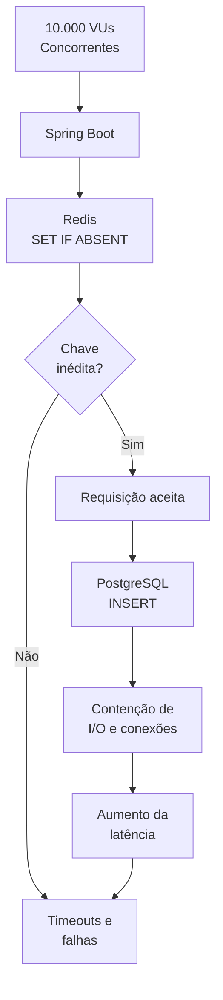
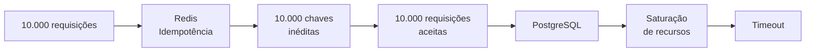
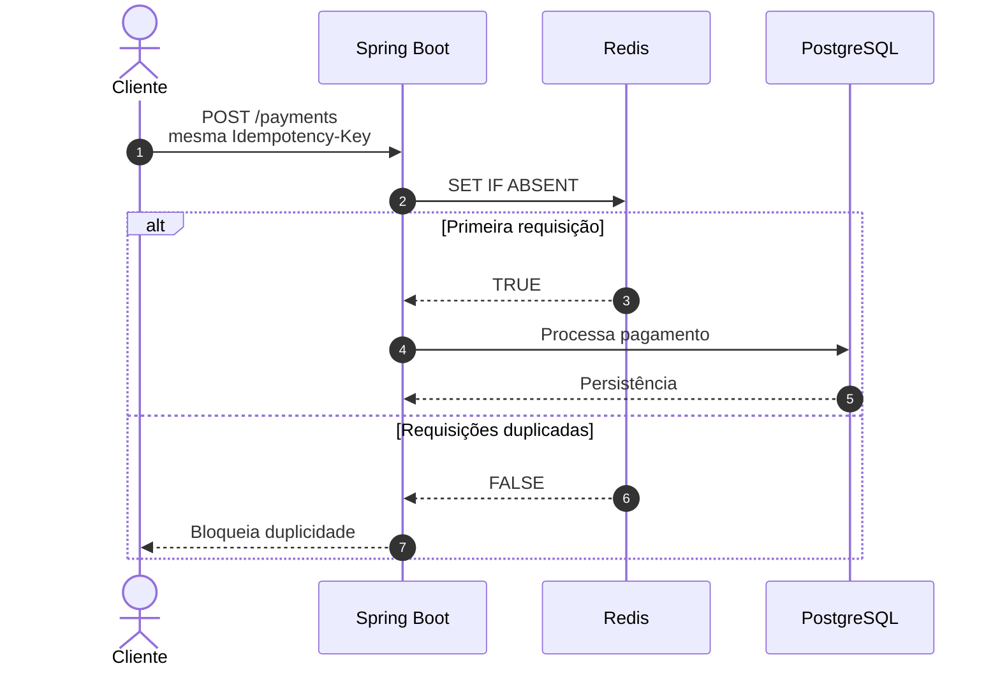
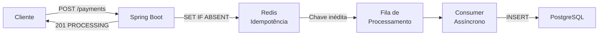
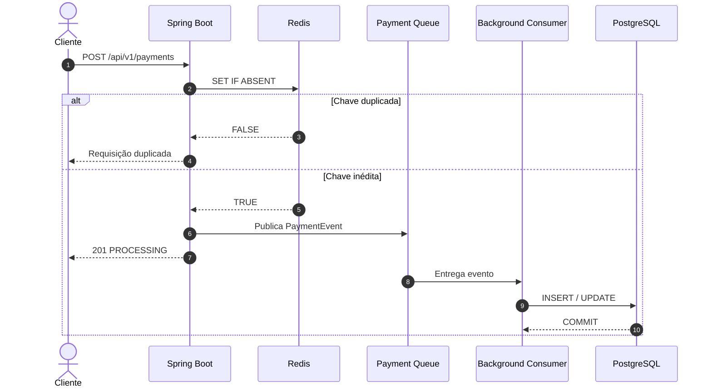

# Relatório Avançado de Engenharia de Performance #004

## 1. Resumo Executivo

* **Data do Teste:** 27 de agosto de 2026

* **Ambiente:** Local (Ubuntu 24.04 LTS / OpenJDK 21)

* **Ferramenta Utilizada:** Grafana k6 v1.x

* **Alvo do Teste:** Endpoint `POST /api/v1/payments`

* **Carga Aplicada:** Rampa progressiva com pico de 10.000 Usuários Virtuais Simultâneos (VUs)

* **Resultado Geral:** **FALHA POR SATURAÇÃO DE ESCRITA SÍNCRONA EM DISCO**

---

## 2. Diagnóstico do Comportamento Estático

O acoplamento do pool Lettuce com `commons-pool2` corrigiu a limitação observada na camada de conexão com o Redis. Entretanto, as métricas de latência permaneceram estagnadas na casa dos **43 segundos**, enquanto a taxa de falhas continuou elevada, atingindo aproximadamente **61,76%**.

Esse resultado demonstra que o gargalo deixou de estar na comunicação com o Redis e passou a se manifestar posteriormente no fluxo de processamento.

O cenário de teste do k6 gera **10.000 chaves de idempotência exclusivas**, utilizando um sufixo dinâmico associado a cada VU. Como as chaves são inéditas na primeira tentativa, as requisições conseguem adquirir o lock no Redis e avançam simultaneamente para a camada de persistência relacional.

O fluxo pode ser representado da seguinte maneira:



O ponto crítico está no fato de que o Redis consegue absorver e validar as chaves rapidamente, mas isso não significa que a camada seguinte possua capacidade equivalente para processar todas as operações simultaneamente.

Nesse cenário específico, as **10.000 chaves inéditas** fazem com que praticamente todas as requisições atravessem o escudo de idempotência e atinjam o PostgreSQL.

O banco passa então a receber uma quantidade extremamente elevada de operações de escrita concorrentes.

O PostgreSQL torna-se, portanto, o principal limitador síncrono do fluxo.

É importante diferenciar esse comportamento do observado no REPORT-002. Naquele teste, a contenção estava fortemente associada à disputa por locks e à persistência concorrente. No REPORT-004, a introdução do pool do Lettuce demonstra que o Redis consegue cumprir seu papel de primeira barreira, mas o teste atual também revela que **um escudo de idempotência não reduz a carga do banco quando cada requisição possui uma chave inédita**.

---

## 3. Análise do Cenário de Carga

O comportamento observado pode ser dividido em três etapas:

### Etapa 1 — Validação no Redis

A aplicação recebe a requisição e executa a operação atômica:

```text
SET IF ABSENT idempotency:{key}
```

Como as chaves são inéditas, o Redis retorna sucesso para praticamente todas as requisições.

### Etapa 2 — Liberação das Requisições

Após a validação da chave, a requisição continua o fluxo normal da aplicação.

Nesse momento, o Redis não está mais atuando como um mecanismo de redução de carga, pois não existem requisições duplicadas suficientes para serem descartadas.

### Etapa 3 — Saturação do PostgreSQL

As requisições aceitas chegam à camada de persistência e iniciam operações de escrita.

A concentração de milhares de operações simultâneas sobre o PostgreSQL aumenta a disputa por:

* conexões;
* CPU;
* memória;
* I/O;
* buffers;
* locks;
* recursos internos de persistência.

O resultado é uma fila crescente de operações, aumento da latência e posterior ocorrência de timeouts.

O princípio observado pode ser resumido:



Isso evidencia uma limitação importante da estratégia atual: **o Redis protege o PostgreSQL contra duplicidades, mas não controla o volume de requisições legítimas que precisam ser persistidas**.

---

## 4. Correções Recomendadas

### 4.1 Abordagem de Validação — Colisão de Chaves

A primeira abordagem recomendada é modificar temporariamente o cenário de carga do k6 para remover a pulverização das chaves por VU.

Em vez de gerar uma chave exclusiva para cada usuário virtual, o teste deverá utilizar uma ou poucas chaves compartilhadas.

O objetivo será provocar deliberadamente colisões de idempotência e verificar a capacidade do Redis de atuar como escudo contra requisições duplicadas.

O cenário esperado será:



Esse teste permitirá medir especificamente o **throughput de rejeição em memória**, isolando a eficiência do Redis como mecanismo de proteção contra concorrência duplicada.

---

### 4.2 Abordagem Arquitetural — Write-Behind

A solução arquitetural escolhida será desacoplar a persistência física do ciclo de vida da requisição HTTP.

Em vez de executar o `INSERT` no PostgreSQL dentro do fluxo síncrono, a aplicação deverá publicar uma mensagem em uma fila de processamento.

O cliente recebe rapidamente a confirmação de que a operação foi aceita, enquanto um consumidor em background processa as gravações de forma controlada.

O fluxo passa a ser:



Essa alteração introduz um importante desacoplamento entre:

**velocidade de recebimento das requisições**

e

**velocidade de persistência no banco de dados**.

O PostgreSQL deixa de precisar acompanhar diretamente a velocidade de chegada das requisições HTTP.

O consumidor passa a controlar a cadência das operações de escrita de acordo com a capacidade real da infraestrutura.

---

## 5. Estratégia de Write-Behind

A arquitetura proposta para o próximo ciclo pode ser resumida em quatro etapas:

1. **Recepção:** o Spring Boot recebe a requisição HTTP.

2. **Idempotência:** o Redis verifica e registra atomicamente a chave.

3. **Enfileiramento:** a operação aceita é enviada para a fila de processamento.

4. **Persistência:** um consumidor assíncrono grava os dados no PostgreSQL de maneira controlada.



Essa abordagem também permite que a taxa de consumo da fila seja ajustada de acordo com a capacidade do banco de dados.

Em vez de permitir que 10.000 requisições tentem escrever simultaneamente no PostgreSQL, o consumidor pode processar as mensagens em uma taxa controlada.

---

## 6. Conclusão Técnica

O REPORT-004 confirmou que a configuração do pool do Lettuce eliminou a limitação anteriormente investigada na camada de conexão com o Redis.

Entretanto, o teste também revelou uma nova característica importante do cenário de carga: como as 10.000 requisições utilizaram **chaves de idempotência inéditas**, praticamente todas foram aceitas pelo Redis e encaminhadas para a camada de persistência.

Consequentemente, o PostgreSQL passou a receber uma quantidade elevada de operações de escrita simultâneas.

O resultado demonstra que existem dois problemas diferentes que precisam ser tratados separadamente:

| Cenário                                | Mecanismo de Proteção             |
| :------------------------------------- | :-------------------------------- |
| Requisições duplicadas                 | Redis + Idempotency Key           |
| Grande volume de requisições legítimas | Fila + Processamento Assíncrono   |
| Escrita excessivamente concorrente     | Consumer com controle de cadência |
| Persistência definitiva                | PostgreSQL                        |

A evolução arquitetural deixa de ser apenas uma questão de **aumentar a capacidade dos componentes** e passa a envolver o **controle do fluxo de trabalho entre eles**.

A próxima etapa será implementar o padrão **Write-Behind**, transformando o PostgreSQL de um componente diretamente exposto à velocidade do tráfego HTTP em um consumidor de operações persistentes controladas.

A expectativa para o próximo teste é observar:

* aumento significativo do throughput HTTP;
* redução da latência das requisições;
* redução da taxa de falhas;
* menor pressão sobre o PostgreSQL;
* desacoplamento entre entrada HTTP e persistência;
* maior estabilidade sob picos de concorrência.

O próximo relatório deverá validar se o **Redis + Fila + Consumer + PostgreSQL** consegue sustentar a carga de 10.000 VUs sem transferir diretamente o pico de tráfego HTTP para a camada de persistência.
