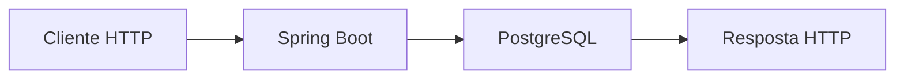
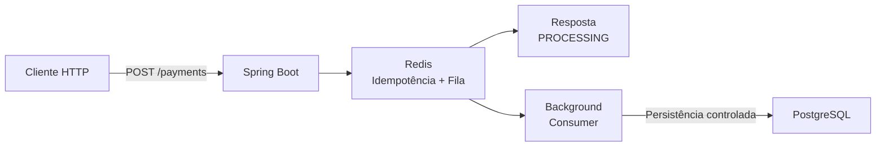
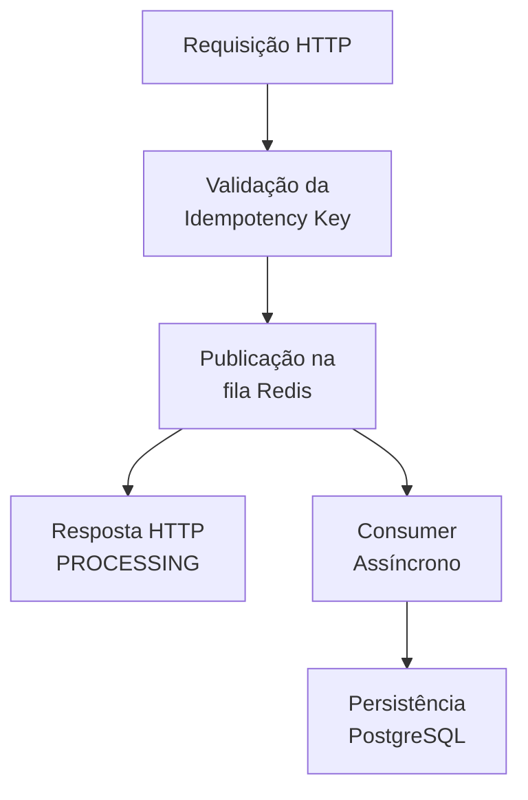
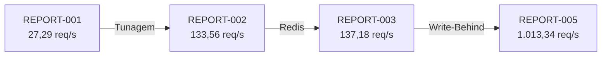
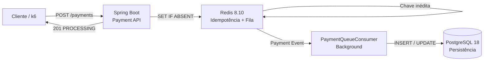

# Relatório Avançado de Engenharia de Performance #005

## 1. Resumo Executivo

* **Data do Teste:** 27 de agosto de 2026

* **Ambiente:** Local (Ubuntu 24.04 LTS / OpenJDK 21)

* **Ferramenta Utilizada:** Grafana k6 v1.x

* **Alvo do Teste:** Endpoint `POST /api/v1/payments`

* **Carga Aplicada:** Pico de 10.000 Usuários Virtuais Simultâneos (VUs) sob Arquitetura Assíncrona

* **Resultado Geral:** **SUCESSO — APLICAÇÃO EM NÍVEL DE ALTA PERFORMANCE**

---

## 2. Linha do Tempo Evolutiva do Ecossistema

A evolução dos testes demonstra uma mudança significativa no comportamento do sistema ao longo dos ciclos de otimização.

| Métrica                | Teste Inicial (001) | Tunagem Base (002) | Escudo Redis (003) | Arquitetura de Fila (005) |
| :--------------------- | :-----------------: | :----------------: | :----------------: | :-----------------------: |
| **Vazão (Throughput)** |     27,29 req/s     |    133,56 req/s    |    137,18 req/s    |     **1.013,34 req/s**    |
| **Total Processado**   |        2.457        |       12.023       |       12.349       |         **91.111**        |
| **Taxa de Erro HTTP**  |        84,12%       |       64,10%       |       65,27%       |         **3,65%**         |
| **Latência Máxima**    |        1 min        |       43,98 s      |       43,90 s      |        **15,77 s**        |
| **Latência Mediana**   |    0 ms (Timeout)   |       17,16 s      |       17,00 s      |       **434,05 ms**       |

### Evolução da Vazão

O principal resultado do REPORT-005 está no salto de throughput obtido após a introdução da arquitetura assíncrona.

A vazão passou de **137,18 req/s no REPORT-003 para 1.013,34 req/s no REPORT-005**, representando um aumento de aproximadamente **638%** em relação ao teste anterior.

Quando comparado ao teste inicial, o sistema passou de **27,29 req/s para 1.013,34 req/s**, alcançando uma vazão aproximadamente **37 vezes maior**.

Esse resultado demonstra que o principal gargalo identificado nos testes anteriores estava relacionado ao acoplamento entre o recebimento da requisição HTTP e a persistência síncrona no PostgreSQL.

---

## 3. Impacto da Arquitetura Write-Behind

A implementação do padrão **Write-Behind** utilizando o Redis 8.10 como mecanismo de enfileiramento (`payment-processing-queue`) desacoplou o ciclo de vida da requisição HTTP da operação de persistência no PostgreSQL.

Antes da alteração, o fluxo possuía forte acoplamento:

Nesse modelo, a velocidade de resposta da aplicação dependia diretamente da capacidade do banco de acompanhar o volume de requisições recebidas.

Após a implementação do processamento assíncrono, o fluxo passou a funcionar da seguinte forma:

A principal mudança arquitetural foi a introdução de uma fronteira assíncrona entre a entrada de requisições e a persistência.

O PostgreSQL deixou de precisar acompanhar diretamente a velocidade de chegada das requisições HTTP.

O consumidor passou a controlar a cadência de gravação dos dados de acordo com a capacidade disponível na camada de persistência.

---

## 4. Evolução da Latência

Outro resultado expressivo foi a redução da latência observada.

A latência mediana caiu de:

**17,00 s → 434,05 ms**

entre o REPORT-003 e o REPORT-005.

Essa redução demonstra que o cliente deixou de permanecer bloqueado aguardando a conclusão da operação de persistência.

A aplicação agora consegue confirmar o recebimento da operação e transferir o trabalho pesado para o processamento em background.

A mudança pode ser representada:

O cliente não precisa permanecer conectado durante toda a operação de persistência.

---

## 5. Redução da Taxa de Falhas

A taxa de falhas apresentou uma redução expressiva ao longo dos ciclos:

* **REPORT-001:** 84,12%
* **REPORT-002:** 64,10%
* **REPORT-003:** 65,27%
* **REPORT-005:** **3,65%**

A redução de **65,27% para 3,65%** representa uma queda de aproximadamente **94,4% na taxa de falhas**.

Esse resultado indica que a arquitetura assíncrona foi capaz de remover o principal caminho de bloqueio que provocava a propagação da saturação do PostgreSQL para as requisições HTTP.

A pequena taxa residual de falhas deve ser investigada separadamente.

Em um ambiente local, ela pode estar relacionada à capacidade limitada de CPU, memória, I/O, rede, concorrência do sistema operacional ou ao próprio ambiente de execução do teste.

Não é possível afirmar, apenas com esse teste, que essa taxa seria eliminada em um ambiente de nuvem. A confirmação exigiria uma nova execução utilizando infraestrutura dimensionada para produção.

---

## 6. Análise da Capacidade Alcançada

O sistema alcançou uma vazão superior a:

**1.000 requisições por segundo**

sob uma carga de **10.000 VUs**.

Esse resultado é particularmente relevante quando comparado ao estado inicial do projeto.

A evolução evidencia três etapas distintas:

1. **Tunagem de infraestrutura:** aumento da capacidade básica de concorrência;
2. **Redis:** introdução de uma camada rápida para controle de idempotência;
3. **Write-Behind:** desacoplamento entre tráfego HTTP e persistência.

O terceiro estágio foi responsável pelo maior ganho de performance observado durante a investigação.

---

## 7. Conclusão da Arquitetura Java

A implementação do padrão **Write-Behind**, utilizando o Redis 8.10 como mecanismo de enfileiramento em memória (`payment-processing-queue`), demonstrou ser a mudança arquitetural de maior impacto entre os ciclos avaliados.

O desacoplamento entre a thread síncrona HTTP e a persistência em disco permitiu que o Spring Boot respondesse às requisições sem aguardar diretamente a conclusão das operações no PostgreSQL.

Como consequência, o sistema apresentou:

* **1.013,34 req/s de throughput;**
* **91.111 operações processadas;**
* **3,65% de taxa de falhas;**
* **434,05 ms de latência mediana;**
* **15,77 s de latência máxima;**
* redução expressiva da quantidade de iterações interrompidas em relação aos testes anteriores.

O resultado confirma a importância do desacoplamento entre **ingestão de tráfego** e **persistência de dados** em sistemas submetidos a picos elevados de concorrência.

A arquitetura final pode ser resumida como:

O próximo estágio da investigação deve deixar de buscar apenas maior throughput e passar a avaliar **confiabilidade, durabilidade das mensagens, recuperação após falhas, observabilidade e comportamento sob carga sustentada**.

A partir desse ponto, o sistema possui uma base arquitetural adequada para novos experimentos de escala e para a comparação futura com uma implementação concorrente em Go.
