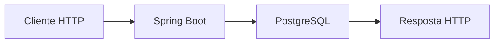
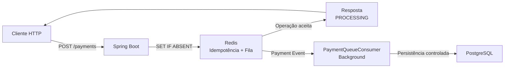
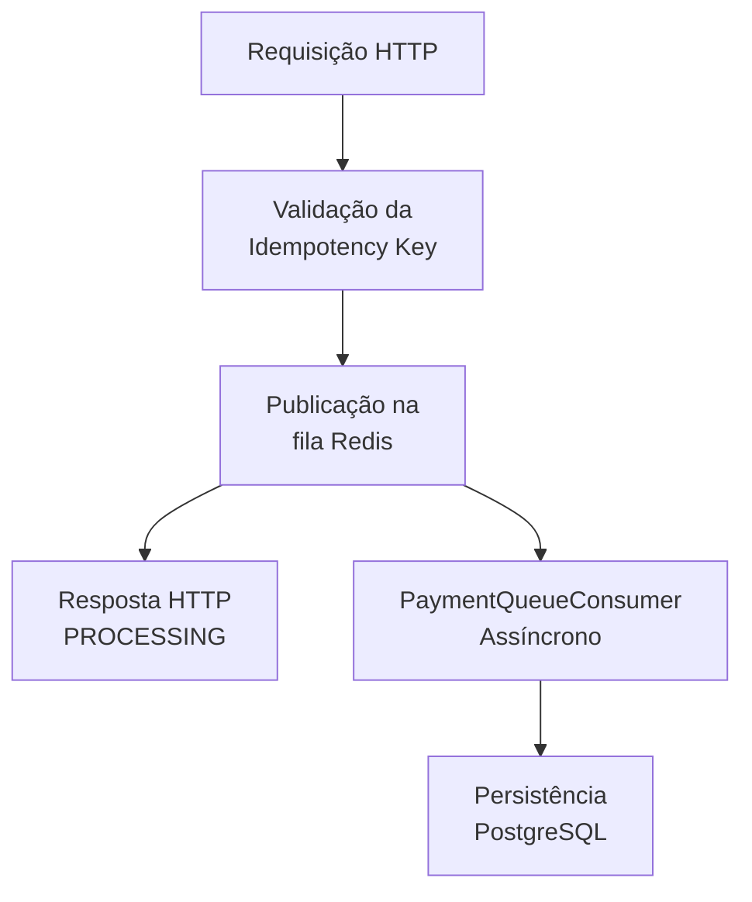
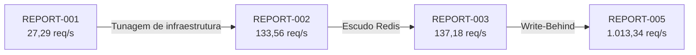
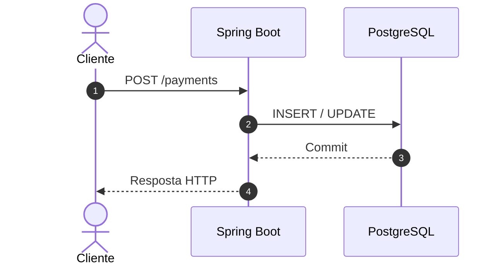
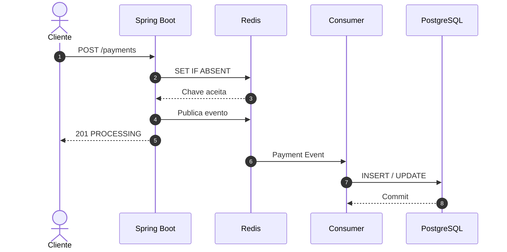
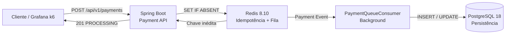

# Relatório Avançado de Engenharia de Performance #005

## 1. Resumo Executivo

* **Data do Teste:** 27 de agosto de 2026

* **Ambiente:** Local (Ubuntu 24.04 LTS / OpenJDK 21)

* **Ferramenta Utilizada:** Grafana k6 v1.x

* **Alvo do Teste:** Endpoint `POST /api/v1/payments`

* **Carga Aplicada:** Pico de 10.000 Usuários Virtuais Simultâneos (VUs) sob arquitetura assíncrona

* **Resultado Geral:** **SUCESSO — EVOLUÇÃO SIGNIFICATIVA DE PERFORMANCE**

O REPORT-005 representa a principal evolução observada durante o ciclo de testes. Após a substituição da persistência síncrona por uma arquitetura baseada em **Write-Behind**, o sistema apresentou aumento expressivo de throughput, redução significativa da latência mediana e forte redução na taxa de falhas HTTP.

O experimento manteve o cenário de carga utilizado nos testes anteriores, permitindo comparar diretamente os resultados antes e depois da alteração arquitetural.

---

## 2. Linha do Tempo Evolutiva do Ecossistema

A evolução dos testes demonstra como diferentes alterações foram utilizadas para identificar e reduzir os gargalos encontrados ao longo da investigação.

| Métrica                | Teste Inicial (001) | Tunagem Base (002) | Escudo Redis (003) | Arquitetura de Fila (005) |
| :--------------------- | :-----------------: | :----------------: | :----------------: | :-----------------------: |
| **Vazão (Throughput)** |     27,29 req/s     |    133,56 req/s    |    137,18 req/s    |     **1.013,34 req/s**    |
| **Total Processado**   |        2.457        |       12.023       |       12.349       |         **91.111**        |
| **Taxa de Erro HTTP**  |        84,12%       |       64,10%       |       65,27%       |         **3,65%**         |
| **Latência Máxima**    |        1 min        |       43,98 s      |       43,90 s      |        **15,77 s**        |
| **Latência Mediana**   |    0 ms (Timeout)   |       17,16 s      |       17,00 s      |       **434,05 ms**       |

### Evolução da Vazão

O principal resultado do REPORT-005 está no aumento de throughput após a introdução da arquitetura assíncrona.

A vazão passou de **137,18 req/s no REPORT-003 para 1.013,34 req/s no REPORT-005**, representando um aumento aproximado de **638,7%**.

Quando comparado ao teste inicial, o throughput passou de **27,29 req/s para 1.013,34 req/s**, correspondendo a aproximadamente **37,1 vezes** a vazão observada no REPORT-001.

A maior evolução ocorreu justamente após a retirada da persistência síncrona do caminho crítico da requisição HTTP.

---

## 3. Impacto da Arquitetura Write-Behind

A implementação do padrão **Write-Behind**, utilizando o Redis 8.10 como mecanismo de enfileiramento (`payment-processing-queue`), alterou significativamente o fluxo de processamento da aplicação.

Antes da alteração, a requisição permanecia diretamente acoplada à persistência no PostgreSQL:

Nesse modelo, a conclusão da requisição dependia diretamente da capacidade do PostgreSQL de processar a operação.

Após a alteração arquitetural, o fluxo passou a ser:

A principal alteração foi a criação de uma **fronteira assíncrona entre o recebimento da requisição e a persistência dos dados**.

Dessa forma, o PostgreSQL deixou de participar diretamente do caminho crítico da resposta HTTP.

O processamento da persistência passou a ser realizado posteriormente pelo `PaymentQueueConsumer`.

---

## 4. Evolução da Latência

A latência mediana apresentou uma redução expressiva ao longo dos testes.

Entre o REPORT-003 e o REPORT-005, a mediana passou de:

**17,00 s → 434,05 ms**

Essa mudança é consistente com a alteração arquitetural realizada.

No modelo anterior, a requisição permanecia vinculada ao processamento síncrono da persistência.

No novo modelo, a API pode concluir o ciclo HTTP após validar a requisição e publicar o evento para processamento posterior.

O fluxo passou a ser:

Essa mudança reduz a dependência direta entre o tempo de resposta HTTP e o tempo necessário para concluir a persistência no banco.

---

## 5. Redução da Taxa de Falhas

A taxa de falhas HTTP apresentou a seguinte evolução:

* **REPORT-001:** 84,12%
* **REPORT-002:** 64,10%
* **REPORT-003:** 65,27%
* **REPORT-005:** **3,65%**

A redução observada entre o REPORT-003 e o REPORT-005 foi de aproximadamente **94,4% na taxa de falhas**.

Esse comportamento indica uma redução significativa dos efeitos de saturação que anteriormente atingiam diretamente o fluxo HTTP.

Entretanto, os **3,65% de falhas residuais** ainda devem ser investigados.

Como os testes foram realizados em ambiente local, existem diversas possibilidades que podem influenciar esse resultado, incluindo:

* capacidade de CPU;
* memória disponível;
* I/O do disco;
* concorrência do sistema operacional;
* limites de rede;
* configuração do ambiente Docker;
* capacidade do PostgreSQL;
* comportamento do próprio cenário de carga.

Portanto, esse resultado deve ser interpretado como **observado no ambiente experimental utilizado**, sem extrapolação direta para ambientes de produção ou infraestrutura em nuvem.

---

## 6. Análise da Capacidade Alcançada

O sistema atingiu uma vazão superior a:

**1.000 requisições por segundo**

sob um cenário de carga com **10.000 VUs**.

A evolução pode ser visualizada:

A evolução evidencia três etapas principais:

### 1. Tunagem de infraestrutura

Ajustes no Tomcat e no HikariCP aumentaram a capacidade de concorrência da aplicação e reduziram parte da saturação observada inicialmente.

### 2. Introdução do Redis

O Redis passou a atuar como camada de controle de idempotência, reduzindo a necessidade de utilizar o banco relacional para determinadas verificações concorrentes.

### 3. Introdução do Write-Behind

A persistência foi removida do caminho crítico da requisição HTTP e transferida para um processamento assíncrono.

Entre as alterações realizadas, essa foi a que apresentou o maior impacto no throughput observado.

---

## 7. Comparação entre Arquitetura Síncrona e Assíncrona

Os resultados permitem comparar diretamente os dois modelos.

### Arquitetura Síncrona

Nesse modelo, o tempo da requisição está diretamente relacionado ao processamento do banco.

### Arquitetura Assíncrona

A principal diferença está na separação entre:

**receber a operação**

e

**persistir a operação**.

Essa separação permite que o sistema responda ao cliente sem aguardar diretamente a conclusão da escrita no PostgreSQL.

---

## 8. Conclusão da Arquitetura Java

A implementação do padrão **Write-Behind**, utilizando o Redis 8.10 como mecanismo de enfileiramento em memória (`payment-processing-queue`), apresentou o maior impacto de performance entre os ciclos avaliados.

O desacoplamento entre o processamento HTTP e a persistência permitiu que o Spring Boot deixasse de aguardar diretamente a conclusão das operações no PostgreSQL para responder ao cliente.

No cenário avaliado, o sistema apresentou:

* **1.013,34 req/s de throughput;**
* **91.111 requisições processadas;**
* **3,65% de taxa de falhas HTTP;**
* **434,05 ms de latência mediana;**
* **15,77 s de latência máxima.**

Quando comparado ao REPORT-001, o throughput evoluiu de **27,29 req/s para 1.013,34 req/s**.

O resultado evidencia que, para o cenário de carga utilizado, **o desacoplamento da persistência foi mais impactante do que os ajustes isolados de infraestrutura realizados nos testes anteriores**.

A arquitetura final pode ser representada da seguinte forma:

O REPORT-005 encerra o primeiro ciclo de investigação de performance e estabelece uma nova linha de base para o projeto.

A próxima etapa deverá utilizar esse resultado como referência para investigar **carga sustentada, stress test, comportamento de backpressure, colisões de idempotência, falhas de infraestrutura e escalabilidade horizontal**.

Dessa forma, os próximos experimentos poderão determinar não apenas o throughput máximo observado, mas também os **limites operacionais e o comportamento da arquitetura sob diferentes condições de carga e falha**.
